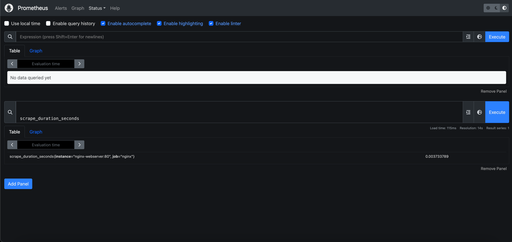
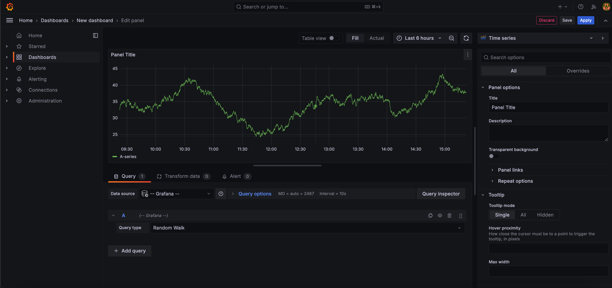
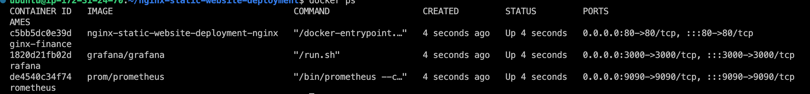

# Static Website Deployment with Nginx, Docker, and Monitoring

## Project Overview

This project demonstrates the deployment of a static website using Nginx, Docker, and Docker Compose, with real-time monitoring through Prometheus and Grafana. The website is served by Nginx, containerized using Docker, and includes automated deployment using a bash script. In addition, the server's performance is monitored with Prometheus and visualized with Grafana.

## Technologies Used

- **Nginx:** Web server for serving the static website.
- **Docker:** Containerization of the Nginx web server and other services.
- **Docker Compose:** Management of multi-container applications.
- **Prometheus:** Monitoring the performance of the Nginx server.
- **Grafana:** Visualization of metrics from Prometheus.
- **Bash Scripting:** Automation of deployment and environment setup.

## Folder Structure

```
.
├── README.md
├── deploy.sh
├── docker-compose.yml
├── monitoring
│   ├── grafana
│   │   ├── csv
│   │   ├── grafana-apiserver
│   │   │   └── resource
│   │   ├── grafana.db
│   │   ├── pdf
│   │   ├── plugins
│   │   └── png
│   └── prometheus
│       └── prometheus.yml
├── nginx
│   └── Dockerfile
│   └── static
└── screenshots
    ├── docker-containers.png
    ├── grafana-dashboard.png
    ├── nginx-homepage.png
    └── prometheus-metrics.png
```

## Setup and Installation

### Prerequisites

- Docker installed on your machine
- Docker Compose installed

### Steps to Run

1. **Clone the Repository:**
   ```bash
   git clone https://github.com/phsinghka/nginx-static-website-deployment.git
   cd nginx-static-website-deployment
   ```

2. **Run the Deployment Script:**
   ```bash
   ./deploy.sh
   ```

3. **Access the Website:**
   Navigate to `http://localhost` to view the static website served by Nginx.

4. **Access Prometheus:**
   Navigate to `http://localhost:9090` to view Prometheus metrics.

5. **Access Grafana:**
   Navigate to `http://localhost:3000` (default login: admin/admin) to view the Grafana dashboard.

## Screenshots

- **Nginx Homepage**  
  

- **Prometheus Metrics**  
  

- **Grafana Dashboard**  
  

- **Docker Containers Running**  
  

## Project Features

- **Nginx Web Server**: A fully functioning static website served via Nginx, with custom configurations.
- **Containerization**: Nginx, Prometheus, and Grafana are all containerized and managed with Docker.
- **Automated Setup**: The project includes a bash script that automates the entire setup process.
- **Monitoring**: Prometheus is used to scrape Nginx metrics, and Grafana provides a rich visualization dashboard.
